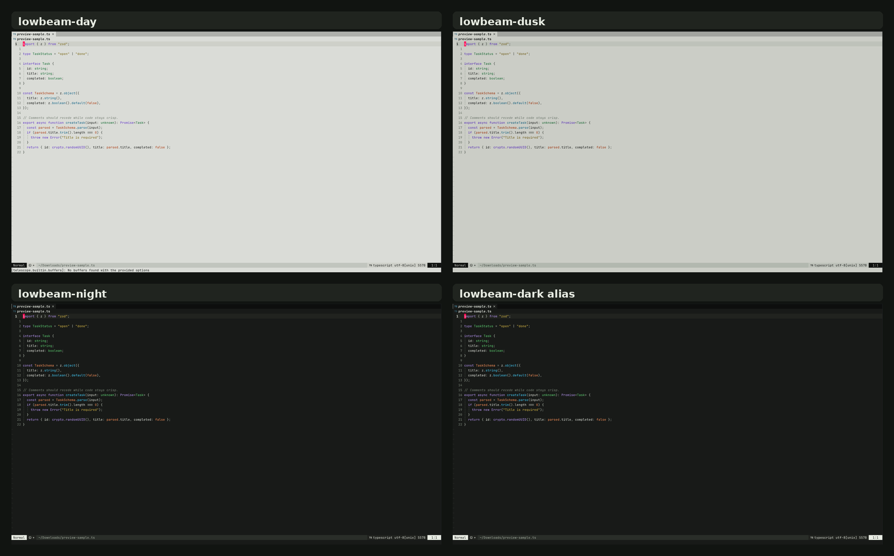

# lowbeam.nvim

A restrained, dim Neovim colorscheme for people who want code to be parsable
without turning the editor into a rainbow or a pastel wash.

Lowbeam is built around a small set of semantic syntax roles, not a different
color for every token type. The palette avoids pastel syntax colors; it uses
clearer high-contrast hues inspired by violet ink, cobalt/petrol, green, brass,
and oxide. The colors are more separated than a monochrome-minimal theme, but
still limited to a small semantic set. The light variants use a clean dim
off-white canvas rather than sepia or brown paper. The dark variant is an analog
of the same palette on a low-glare charcoal surface.


## Screenshots



Individual captures are available in [`extras/screenshots`](./extras/screenshots).

## Project policy

Lowbeam is public source, but it is not accepting outside contributions.

You are free to use it, configure it, and fork it. Pull requests are not accepted
because the project intentionally has a narrow visual direction. See
[`FORKING.md`](./FORKING.md) for the full policy.

## Rationale

Many light themes are hard to tune for daytime dimness, become glaring at night,
or use so many syntax colors that scanning code becomes disorienting. Lowbeam
keeps normal code mostly neutral, reserves color for semantic structure, and
keeps diagnostics/diffs separate from syntax. After dimming the light backgrounds,
the foreground and syntax hues are intentionally stronger so code remains crisp
instead of hazy. Comments are intentionally weaker than code so they recede
while scanning, especially in TypeScript-heavy files.

## Palette rule

Lowbeam uses five firm, non-pastel syntax hues. They are saturated and separated
so semantic roles remain distinguishable at smaller font sizes:

| Role | Used for |
| --- | --- |
| `keyword` | control flow, declarations, imports, returns |
| `func` | functions, methods, calls |
| `type` | classes, interfaces, types, constructors |
| `string` | strings and character literals |
| `constant` | numbers, booleans, constants, escapes, special literals |

Everything else is neutral unless it represents editor state, search, diagnostics,
or diffs.

## Variants

Lowbeam can be selected directly from `:colorscheme`:

```vim
:colorscheme lowbeam
:colorscheme lowbeam-day
:colorscheme lowbeam-dusk
:colorscheme lowbeam-night
:colorscheme lowbeam-dark
```

| Command | Background | Notes |
| --- | --- | --- |
| `lowbeam` | configurable | Uses `setup({ style = ... })`; defaults to `day`. |
| `lowbeam-day` | light | Dim off-white light background. |
| `lowbeam-dusk` | light | Lower-luminance off-white for evening or glare-sensitive use. |
| `lowbeam-night` | dark | Dark analog on a low-glare charcoal background. |
| `lowbeam-dark` | dark | Alias entry point for `night`. |

Variant commands do **not** discard your setup options. This means you can set
shared overrides once, then switch styles with `:colorscheme lowbeam-dusk` or
`:colorscheme lowbeam-night`.

## Install

### lazy.nvim

```lua
{
  "adejolx-kora/lowbeam.nvim",
  priority = 1000,
  config = function()
    require("lowbeam").setup({})

    vim.cmd.colorscheme("lowbeam-day")
  end,
}
```

### packer.nvim

```lua
use({
  "adejolx-kora/lowbeam.nvim",
  config = function()
    require("lowbeam").setup({ style = "day" })
    vim.cmd.colorscheme("lowbeam-day")
  end,
})
```

## Configuration

```lua
require("lowbeam").setup({
  -- Used by :colorscheme lowbeam. Variant-specific commands can still be used.
  style = "day", -- "day" | "dusk" | "night" | "dark"

  transparent = false,
  dim_inactive = false,
  semantic_tokens = true,

  styles = {
    comments = { italic = true },
    keywords = {},
    functions = {},
    types = {},
    strings = {},
  },

  integrations = {
    treesitter = true,
    lsp = true,
    telescope = true,
    nvim_tree = true,
    neo_tree = true,
    gitsigns = true,
    cmp = true,
    which_key = true,
    lazy = true,
    snacks = true,
  },
})
```

Then load one of the variants:

```lua
vim.cmd.colorscheme("lowbeam-dusk")
```

## Extending the palette

Lowbeam is public-theme friendly: users can keep the core theme while adjusting
colors or adding plugin highlights without forking.

### Override palette values

Use `palettes.all` for every variant, or target one variant directly.

```lua
require("lowbeam").setup({
  palettes = {
    all = {
      comment = "#707970",
    },
    dusk = {
      bg = "#C7CAC2",
      bg_alt = "#BABFB7",
    },
    night = {
      bg = "#151715",
    },
  },
})
```

### Transform the palette with a callback

```lua
require("lowbeam").setup({
  on_palette = function(colors, style)
    if style == "dusk" then
      colors.keyword = "#5526C8"
    end

    return colors
  end,
})
```

### Override highlight groups

`highlights` accepts either a highlight table, a function, or `false` to remove a
highlight group from Lowbeam's generated table.

```lua
require("lowbeam").setup({
  highlights = {
    Comment = { italic = false },
    CursorLine = function(colors)
      return { bg = colors.bg_soft }
    end,
    ["@lsp.type.variable"] = false,
  },
})
```

### Add plugin support without forking

```lua
require("lowbeam").setup({
  on_highlights = function(groups, colors)
    groups.MyPluginTitle = { fg = colors.keyword, bold = true }
    groups.MyPluginMuted = { fg = colors.fg_faint }

    return groups
  end,
})
```

## Design constraints

- Dim off-white light canvas, not sepia/brown paper.
- Dark analog available without changing the semantic role model.
- Selectable variants from `:colorscheme`.
- Non-pastel syntax colors.
- Small syntax hue count.
- Higher chroma syntax roles for small-font readability.
- High contrast for normal code text and syntax on dim backgrounds.
- Comments deliberately lower in prominence than actual code.
- Neutral variables/properties/punctuation.
- Diagnostics and diffs are not part of the normal syntax palette.
- Tree-sitter and LSP semantic tokens are mapped back into the same small role set.
- User extension points should map new plugin groups into existing roles before
  adding new palette colors.

## Contrast direction

The light backgrounds are dimmed, so the foreground ladder is deliberately firm:

```lua
-- day
bg = "#DADCD6"
fg = "#101311"
comment = "#747D73"

-- dusk
bg = "#CBCDC6"
fg = "#0D100E"
comment = "#687268"

-- night
bg = "#181A18"
fg = "#E9EDE4"
comment = "#7F8A7C"
```

Normal text and syntax colors target strong body-text contrast. Comments are
kept below syntax prominence on purpose. Only faint UI elements such as line
numbers, borders, and separators are allowed to sit lower.

## Taking clean screenshots

A preview screenshot should show the theme, not diagnostics or editor chrome.
For clean captures, open the sample file and turn off diagnostic UI first:

```vim
:edit extras/preview-sample.ts
:lua vim.diagnostic.enable(false); vim.o.number = false; vim.o.relativenumber = false; vim.o.signcolumn = "no"; vim.o.cursorline = false
```

Then capture each variant:

```vim
:colorscheme lowbeam-day
:colorscheme lowbeam-dusk
:colorscheme lowbeam-night
:colorscheme lowbeam-dark
```

More details are in [`extras/screenshot-guide.md`](./extras/screenshot-guide.md).

## Development

Clone into your local Neovim packages directory or load it with your plugin
manager from a local path.

```bash
git clone https://github.com/adejolx-kora/lowbeam.nvim ~/.local/share/nvim/site/pack/dev/start/lowbeam.nvim
```

Open Neovim and run:

```vim
:colorscheme lowbeam-day
:colorscheme lowbeam-dusk
:colorscheme lowbeam-night
```

## License

MIT
